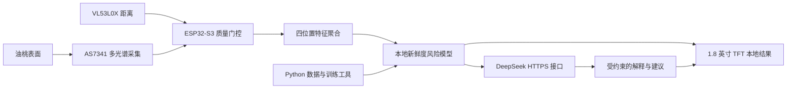
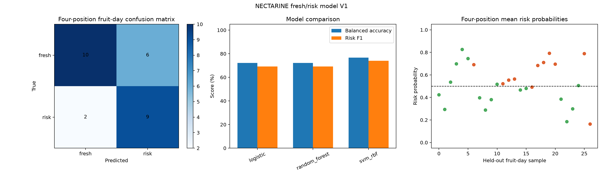

# 基于 ESP32-S3 与多光谱感知的油桃新鲜度风险筛查系统

本项目是物联网设计竞赛原型，使用 ESP32-S3、AS7341 多光谱传感器、
VL53L0X 距离传感器和 1.8 英寸 SPI 屏，对油桃表面进行四位置光谱采集，
在设备端完成新鲜度风险判断，并通过 DeepSeek 生成受本地结论约束的解释与建议。

> 本系统用于“表面新鲜度与腐坏风险筛查”，不是食品安全认证设备，不能替代人工检查、
> 实验室检测或专业质量检验。

## 主要功能

- AS7341 F1–F8、Clear、NIR 多通道采集
- 模块白色补光灯控制与环境光扣除
- VL53L0X 15–25 mm 距离质量门控
- 四位置、每位置 20 帧的引导式测量流程
- ESP32-S3 本地逻辑回归与轻量随机森林联合推理
- 本地输出 `fresh` / `risk`、置信度和局部异常提示
- 断网时保留本地结果，联网后可请求 DeepSeek 解释
- TFT 中文操作界面、云端状态和报告显示
- Python 串口采集、数据审计、趋势分析、模型训练与 C 头文件导出

## 系统架构



大模型不负责替代传感器模型做判断。ESP32 先形成结构化本地结论，DeepSeek 只负责解释
该结论并给出处理建议；云端失败不会阻断本地检测。

## 仓库结构

```text
fruit-freshness-iot/
├─ firmware/       ESP-IDF 固件、传感器驱动、模型推理和 TFT 界面
├─ ai/             Python 采集、分析、训练、模型卡和测试
├─ docs/           架构、状态与发布说明
├─ SECURITY.md     密钥与 Wi-Fi 配置安全要求
└─ README.md
```

## 硬件

- ESP32-S3 开发板
- AS7341 多光谱传感器模块（带白色补光灯）
- VL53L0X 测距模块
- 1.8 英寸 SPI TFT
- 开发板 KEY0–KEY3（通过 XL9555 扩展 IO 读取）
- 稳定供电与固定/遮光结构

## 当前模型

`NECT_FRESHNESS_V1` 使用 6 颗独立油桃、102 个位置样本。每个位置先聚合 20 帧，
使用 8 个可见光通道和 NIR 相对于 Clear 的归一化特征，并采用留一整颗水果验证，
避免同一水果同时进入训练集和测试集。

- 单位置准确率：61.76%
- 单位置平衡准确率：62.58%
- 四位置/水果日准确率：70.37%
- 四位置/水果日平衡准确率：72.16%
- 四位置/水果日风险 F1：69.23%

完整数据范围、门控规则和限制见
[`ai/models/NECT_FRESHNESS_V1_model_card.md`](ai/models/NECT_FRESHNESS_V1_model_card.md)。



## 快速开始

### 1. Python 环境

```powershell
cd ai
python -m venv .venv
.\.venv\Scripts\python.exe -m pip install -r requirements.txt
.\.venv\Scripts\python.exe -m unittest discover -s tests -v
```

采集前修改 `ai/config/experiment.json` 中的串口号。列出串口：

```powershell
.\.venv\Scripts\python.exe src\serial_collect.py --list-ports
```

### 2. ESP-IDF 固件

建议使用 ESP-IDF 5.2.x：

```powershell
cd firmware
idf.py set-target esp32s3
idf.py build
idf.py flash monitor
```

首次编译前复制本地配置示例：

```powershell
Copy-Item main\app_wifi_credentials.example.h main\app_wifi_credentials.h
Copy-Item main\cloud_gateway_config.example.h main\cloud_gateway_config.h
```

然后只在本机配置文件中填写 Wi-Fi 和 DeepSeek API Key。真实配置已被 `.gitignore`
排除，禁止提交到 Git。

### 3. 演示流程

固件采用按键引导的四位置采集。每次保持油桃表面距离传感器 15–25 mm，完成 P1–P4 后
得到本地结果，再由 KEY0 主动请求 DeepSeek 报告。详细步骤见
[`firmware/FRESHNESS_DEMO.md`](firmware/FRESHNESS_DEMO.md)。

## 数据与复现范围

仓库包含训练所需的位置级汇总数据、模型指标、模型头文件和代表性图表；原始逐帧 CSV
默认不公开，以控制仓库体积并保留实验原始记录。发布数据位于 `ai/data/processed/`。

训练并导出 ESP32 头文件：

```powershell
cd ai
.\.venv\Scripts\python.exe src\train_freshness_classifier.py `
  --esp-header "..\firmware\main\nect_freshness_model.h"
```

## 已知限制

- 数据规模较小，目前只针对本批次油桃比赛原型。
- `warning` / `spoiled` 人工标签受硬度与表面观察影响。
- 局部腐坏必须至少有一个采集位置直接覆盖异常区域。
- 当前指标不能代表跨品种、跨产地、跨季节的泛化能力。
- DeepSeek API Key 直接写入本地比赛固件配置，仅适合受控演示；正式产品应通过安全网关托管密钥。

## 项目状态

ESP32 传感器、四位置测量、本地模型、中文 TFT 流程和 DeepSeek 直连链路已经完成并通过
实机联调。后续重点是扩大独立水果和腐坏样本、完善机械固定/遮光结构以及执行更多断网、
超时和跨批次验证。详见 [`docs/STATUS.md`](docs/STATUS.md)。
